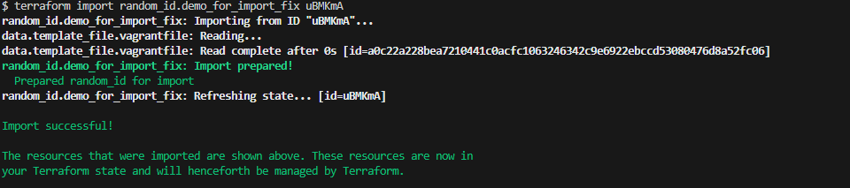

## 🔁 Fix Path 2: Rebuild State Using `terraform import`

### 🧠 What Is It?

When Terraform loses track of resources due to deletion or corruption of the `.tfstate` file, but the resources still **physically exist** in your cloud environment, you do **not** want to:

* Recreate them → may lead to **downtime** or **duplicates** ❌
* Ignore them → results in **orphaned infra**, **security gaps**, and **wasted costs** ❌

Instead, you use:

```bash
terraform import <resource_type>.<resource_name> <resource_id>
```

<br>

### 🛠 Fixing Our Lab

- I hope you have deleted the tfstate file.
- You previously saved the resource ID for `random_id.demo_for_import_fix`.

Since you already know:

* The resource type: `random_id`
* The resource name: `demo_for_import_fix`
* The saved resource ID: e.g., `_3gKv`

Run:

```bash
terraform import random_id.demo_for_import_fix _3gKv
```

✅ You'll see a success message like:



<br>

### 📂 Confirm State Recovery

* Open the **MinIO console**.
* Navigate to your Terraform state bucket.
* You'll see that the `terraform.tfstate` file is immediately recreated and now includes the `random_id` resource.

<br>

### 🔍 Verify the Import
[Verify](./verify.md#-verify-path-2-rebuild-state-using-terraform-import)

<br>

### 🧠 How `terraform import` Works Under the Hood

#### ✅ Real-World Cloud Example

Let's say your Terraform config defines an EC2 instance like this:

```hcl
resource "aws_instance" "web" {
  ami           = "ami-0abcd1234567890"
  instance_type = "t3.micro"
}
```

And that the actual EC2 instance **already exists** with ID `i-09abcd1234xyz5678`.

You run:

```bash
terraform import aws_instance.web i-09abcd1234xyz5678
```

Here’s what Terraform does behind the scenes:

#### 🔁 Step-by-Step

1. **Terraform receives**:

   * Resource type: `aws_instance`
   * Name: `web`
   * ID: `i-09abcd1234xyz5678`

2. It uses the **AWS SDK** to call the cloud API:

```go
   DescribeInstances(instance-id="i-09abcd1234xyz5678")
```

3. AWS responds with instance metadata:

```json
   {
     "Reservations": [
       {
         "Instances": [
           {
             "InstanceId": "i-09abcd...",
             "AmiId": "ami-0abcd1234",
             "InstanceType": "t3.micro",
             "Tags": [{"Key": "Name", "Value": "prod-web"}],
             ...
           }
         ]
       }
     ]
   }
```

4. Terraform **writes this metadata** into the `.tfstate` file under the resource block for `aws_instance.web`.

5. Next time you run:

```bash
 terraform plan
```

   Terraform compares:

   * The `.tf` file config
   * The rebuilt `.tfstate`
   * The real-world infrastructure

6. If they all match → ✅ **No changes**

7. If mismatches exist → tweak `.tf` or apply to sync.

<br>

## ❓Do We Manually Import Every Resource?
- In small labs: Yes
- In large production: No, we automate manual import doesn't scale. 

Using Tools like:
[Terraformer](https://github.com/GoogleCloudPlatform/terraformer)
[Terracognita](https://cycloid.io/terracognita/)

They:

* **Scan existing infrastructure**
* Auto-generate:

  * Terraform `.tf` HCL files
  * Matching `terraform import` commands

#### Example:

```bash
terraformer import aws --resources=ec2,s3 --regions=us-west-2
```

This avoids **100+** manual imports.

<br>

[👉 Fix Path 3: `Recreate + Manually clean orphaned infra`](./fix-path-3.md)
> Before that insure `tfstate` file is deleted!
