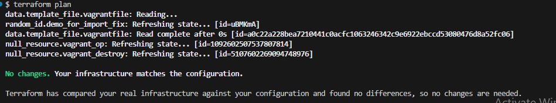
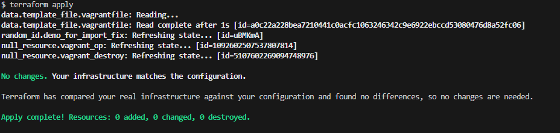
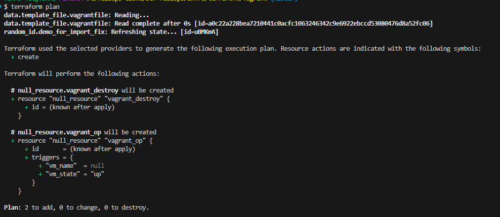
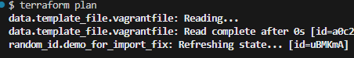

## 🗂 Verify Path 1: Restore backup from MinIO versioning

Once you've restored the correct version of the `terraform.tfstate` file from MinIO, it's time to verify everything works as expected.

<br>

### 🔍 Step: Run Terraform Plan

```bash
terraform plan
```



<br>

### ✅ What You Should See:

* **No new resources** are created.
* **No resources are destroyed.**
* **No changes are detected.**

> This means Terraform has successfully picked up the restored state and sees your infrastructure as **already in sync**.

<br>

### 🧪 Final Confirmation: Run Terraform Apply

```bash
terraform apply
```



<br>

### 📌 Outcome

* ✅ No resources are recreated or modified.
* ✅ No duplication, no double billing.
* ✅ No new `terraform.tfstate` file is generated.
* ✅ Infrastructure state is fully recovered.

<br>

> 🎯 **Key Insight:**
> Even if your `terraform.tfstate` is deleted, **versioning in MinIO (or S3)** ensures you can **quickly restore** a previous state and **avoid any destructive actions**.

> Always **enable versioning** on your state storage backend — it's your safety net!
>
> If don't want to proceed further and want to resume later on 
> [Destroy or Halt VMs After Completion](../../README.md#-destroy-or-halt-vms-after-scenario-completion)

<br>

## 🔁 Verify Path 2: Rebuild State Using `terraform import`

After importing, let's verify that Terraform tracks the resource and doesn't recreate it.

```bash
terraform plan
```

* **Plan Output**:
  

* **Imported Resource ID**:
  

<br>

### ⚠️ Why Plan Output Shows New Resources

You might notice `terraform plan` still shows that it wants to **add** certain resources.

🧠 That’s because:

* **`null_resource`** is **stateless** and purely for local provisioning (`local-exec`).
* Once you delete the `.tfstate` file, **Terraform cannot re-import `null_resource` instances**, because they don’t exist in any external provider (like AWS or GCP).
* So these are shown as new additions.

✅ But — **the resource you imported (e.g., `random_id` or `aws_instance`)** is *not* re-created.
Terraform now tracks it again and syncs it to the `.tfstate` file.

<br>

### ✅ When to Use This Approach

Use `terraform import` when:

* ✅ You **know** the resource still exists in real infrastructure.
* ✅ You want Terraform to **track it again**.
* ✅ You want to avoid unnecessary **re-creation** or **downtime**.

<br>

### 🧠 Why the Resource Must Exist in Your `.tf` File

- Import without config - State is updated, but plan may destroy

Let’s say you run this command:

```bash
terraform import aws_instance.my_vm i-123abc456def
```

But your **`.tf` config** does **not** define `aws_instance.my_vm`.

What happens?

<br>

#### 🔄 Result:

* ✅ Terraform **updates the `.tfstate` file** with this EC2 instance.
* ❌ But on the next `terraform plan`, Terraform says:

```bash
I don't see any config for aws_instance.my_vm, so I'll delete it!
```

🔄 Result:
✅ Terraform updates the state to include that EC2 instance.

<br>

### 🚨 Why This Happens

Terraform follows this order of truth:

```
1. Code (.tf files) → source of desired state  
2. State file (.tfstate) → source of current tracked infra
```

So if the `.tf` config **doesn't declare** a resource that’s in state:

> Terraform assumes you’ve deleted it from your desired setup
> → So it marks the resource for destruction.
>
> If don't want to proceed further and want to resume later on 
> [Destroy or Halt VMs After Completion](../../README.md#-destroy-or-halt-vms-after-scenario-completion)

<br>

## ✅ Best Practices
- 💾 Always back up `terraform.tfstate`
- ☁️ Use remote backends (S3, MinIO) with versioning
- 🧪 Import only when resource `already exists`
- ✅ After import, run `terraform plan` to validate sync

